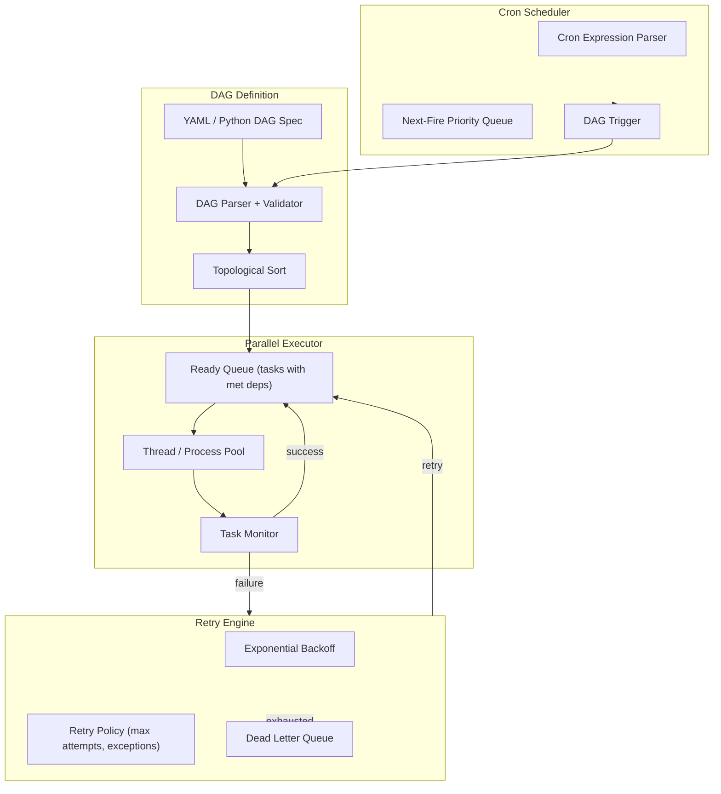
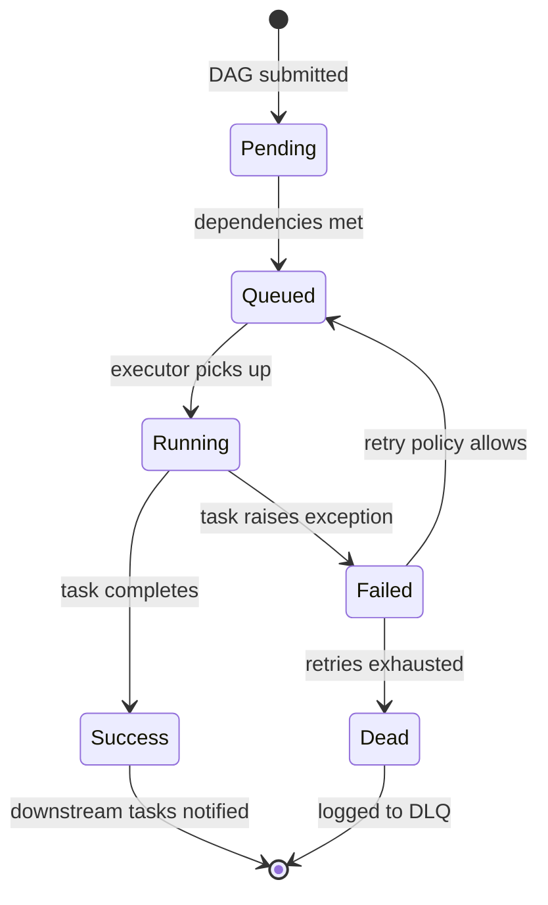
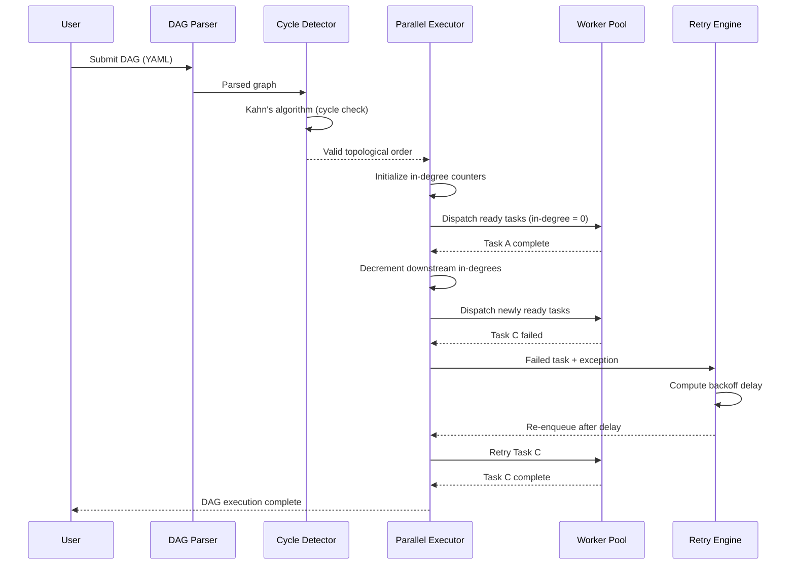

# DAG Workflow Engine

A task orchestration engine that models workflows as directed acyclic graphs (DAGs), resolves dependencies via topological sort, executes tasks in parallel where possible, handles retries with exponential backoff, and supports cron-based scheduling. Think Airflow-lite, built from scratch.

## Theory & Background

### Why DAGs for Workflows

Most real-world workflows have dependencies: you cannot load data into a warehouse until the extract job finishes, and you cannot run the report until the load completes. But some tasks are independent and can run at the same time. A directed acyclic graph captures this structure naturally — nodes are tasks, edges are "must complete before" relationships, and the absence of cycles guarantees that a valid execution order exists. This is the same abstraction used by Airflow, Prefect, and every serious workflow orchestrator.

### Directed Acyclic Graphs and Topological Sort

Formally, a workflow DAG is $G = (V, E)$ where $V$ is the set of tasks and $E \subseteq V \times V$ is the set of dependency edges. The critical constraint is that $G$ must be acyclic — no circular dependencies. If task A depends on B and B depends on A, no valid execution order exists.

A valid execution order is any topological ordering of $G$:

```math
\text{topo}(G) = (v_1, v_2, \ldots, v_n) \quad \text{such that} \quad (v_i, v_j) \in E \implies i < j
```

This says: if there is an edge from $v_i$ to $v_j$, then $v_i$ must appear before $v_j$ in the ordering. Kahn's algorithm (BFS-based) computes this in $O(|V| + |E|)$ by repeatedly removing nodes with zero in-degree. If the algorithm terminates before processing all nodes, a cycle exists — the engine reports the exact cycle path for debugging.

### Parallel Execution and Critical Path

Tasks without mutual dependencies can execute concurrently. The maximum parallelism at any point is the width of the DAG — the size of the largest antichain (set of mutually independent tasks). But parallelism has limits. The minimum total execution time is determined by the critical path — the longest weighted path through the DAG:

```math
T_{\text{critical}} = \max_{p \in \text{Paths}(G)} \sum_{v \in p} w(v)
```

where $w(v)$ is the execution time of task $v$. No amount of parallelism can reduce total time below the critical path length. The engine uses this to prioritize scheduling: tasks on the critical path get scheduled first, because delaying them delays everything.

For a DAG with $n$ tasks and maximum parallelism $k$, the speedup over sequential execution is bounded by:

```math
\text{Speedup} \leq \min\!\left(k, \frac{\sum_{v \in V} w(v)}{T_{\text{critical}}}\right)
```

This is Amdahl's law applied to DAG scheduling — the sequential bottleneck (critical path) limits how much parallelism helps.

### Retry with Exponential Backoff

Transient failures (network timeouts, resource contention) are common in distributed workflows. Retrying immediately often makes things worse — the resource is still overloaded. The engine retries failed tasks with exponential backoff plus jitter:

```math
t_{\text{wait}}(k) = \min\!\left(t_{\text{max}},\; t_{\text{base}} \cdot 2^k + \text{Uniform}(0, t_{\text{jitter}})\right)
```

where $k$ is the retry attempt number, $t_{\text{base}}$ is the initial delay, and $t_{\text{max}}$ caps the maximum wait. The jitter term is critical — without it, multiple failed tasks retry at the exact same time, causing a thundering herd that re-triggers the original failure.

The probability of eventual success after $n$ retries, given per-attempt failure probability $q$:

```math
P(\text{success within } n \text{ retries}) = 1 - q^{n+1}
```

With $q = 0.1$ (90% per-attempt success rate) and $n = 3$ retries, the probability of eventual success is $1 - 0.1^4 = 0.9999$. This is why even a small number of retries dramatically improves reliability.

### Cron Scheduling

Periodic workflows are triggered by cron expressions. The scheduler parses cron syntax (minute, hour, day-of-month, month, day-of-week) and computes the next fire time:

```math
t_{\text{next}} = \min\{t > t_{\text{now}} \mid t \in \text{CronSet}(expr)\}
```

where $\text{CronSet}(expr)$ is the (infinite) set of timestamps matching the cron expression. The scheduler maintains a priority queue of upcoming triggers, sorted by next fire time. Computing the next fire time requires forward scanning through the cron fields with early termination — brute-force enumeration is too slow for expressions like "every 5 minutes."

### Tradeoffs and Alternatives

**Kahn's algorithm vs. DFS topological sort**: Kahn's (BFS-based) naturally detects cycles — if the output has fewer nodes than the graph, a cycle exists. DFS-based topological sort is equally fast but requires separate cycle detection via back-edge tracking. This engine uses Kahn's for the cleaner cycle detection, then DFS only to report the exact cycle path when one is found.

**Thread pool vs. process pool**: The executor supports both. Thread pools have lower overhead and share memory, making them ideal for I/O-bound tasks (API calls, database queries). Process pools avoid the GIL and are better for CPU-bound tasks (data transformations, compression). The default is threads; users can switch per-DAG.

**Static vs. dynamic scheduling**: Static scheduling computes the full execution plan upfront. Dynamic scheduling re-evaluates after each task completes, which handles variable task durations better but adds planning overhead. This engine uses dynamic scheduling — the ready queue is updated in real time as tasks complete, and critical-path priority is recomputed when task durations deviate from estimates.

**Full jitter vs. equal jitter**: Full jitter ($\text{Uniform}(0, t_{\text{base}} \cdot 2^k)$) spreads retries more evenly but can produce very short waits. Equal jitter ($t_{\text{base}} \cdot 2^k / 2 + \text{Uniform}(0, t_{\text{base}} \cdot 2^k / 2)$) guarantees a minimum wait. This engine uses full jitter with a floor, combining the spread of full jitter with a minimum backoff guarantee.

### Engine Architecture



### Task Lifecycle State Machine



### DAG Execution Sequence



### Parallel Execution Timeline

```mermaid
gantt
    title DAG Execution with Parallelism
    dateFormat X
    axisFormat %s

    section Critical Path
        Task A (extract)       :0, 3
        Task D (transform)     :3, 7
        Task F (load)          :7, 10

    section Parallel Branch 1
        Task B (validate)      :0, 2
        Task E (enrich)        :3, 5

    section Parallel Branch 2
        Task C (fetch API)     :0, 4

    section Finalization
        Task G (notify)        :10, 11
        Task H (cleanup)       :10, 11
```



### Key References

- Kahn, "Topological Sorting of Large Networks" (1962) — [CACM](https://dl.acm.org/doi/10.1145/368996.369025)
- Cormen et al., "Introduction to Algorithms" — Chapter 22: Topological Sort and DAG Shortest Paths
- Amazon Builders' Library, "Timeouts, retries, and backoff with jitter" — [AWS](https://aws.amazon.com/builders-library/timeouts-retries-and-backoff-with-jitter/)
- Apache Airflow Documentation — [airflow.apache.org](https://airflow.apache.org/docs/)
- Vitter, "Random Sampling with a Reservoir" (1985) — [ACM TOMS](https://dl.acm.org/doi/10.1145/3147.3165) (used in load balancing)

## Real-World Applications

DAG-based workflow engines are the backbone of automated data processing, letting organizations define complex multi-step jobs with dependencies, run them reliably on a schedule, and recover gracefully from failures. Any operation that involves "do X, then Y, but Z can run in parallel" benefits from this pattern.

| Industry | Use Case | Impact |
|----------|----------|--------|
| Data Engineering | Orchestrating ETL pipelines that extract from dozens of sources, transform in parallel, and load into warehouses on a nightly schedule | Replaces fragile cron scripts with dependency-aware execution, reducing pipeline failures by 70-90% |
| Machine Learning | Managing ML training pipelines: data prep, feature engineering, model training, evaluation, and deployment as a single reproducible workflow | Ensures reproducibility and automates retraining, cutting model refresh cycles from weeks to hours |
| CI/CD | Coordinating build, test, and deploy stages where test suites run in parallel and deployment waits for all tests to pass | Maximizes build parallelism while enforcing quality gates, reducing CI time by 40-60% |
| Financial Services | Running end-of-day batch processing: trade reconciliation, risk calculations, regulatory reporting, all with strict ordering constraints | Guarantees regulatory deadlines are met with automatic retry on transient failures, reducing manual intervention |
| IoT / Manufacturing | Processing sensor data streams through validation, aggregation, anomaly detection, and alerting pipelines triggered every few minutes | Enables near-real-time monitoring with fault tolerance, catching equipment issues before they cause downtime |

## Project Structure

```
dag-workflow-engine/
├── src/
│   ├── __init__.py
│   ├── dag/
│   │   ├── __init__.py
│   │   ├── graph.py               # DAG data structure with adjacency lists
│   │   ├── parser.py              # YAML DAG definition parser
│   │   ├── validator.py           # Cycle detection and dependency validation
│   │   └── topo_sort.py           # Kahn's algorithm topological sort
│   ├── executor/
│   │   ├── __init__.py
│   │   ├── parallel_executor.py   # Thread/process pool task executor
│   │   ├── task_runner.py         # Individual task execution with timeout
│   │   └── state_manager.py       # Task state tracking and transitions
│   ├── scheduler/
│   │   ├── __init__.py
│   │   ├── cron_parser.py         # Cron expression parser and next-fire computation
│   │   ├── scheduler.py           # Priority-queue based scheduler loop
│   │   └── trigger.py             # DAG trigger and parameterization
│   └── retry/
│       ├── __init__.py
│       ├── backoff.py             # Exponential backoff with jitter
│       ├── policy.py              # Retry policy (max attempts, retryable exceptions)
│       └── dead_letter.py         # Dead letter queue for exhausted retries
├── configs/
│   └── sample_dag.yaml
├── data/
│   └── README.md
├── requirements.txt
├── .gitignore
└── README.md
```

## Quick Start

```bash
pip install -r requirements.txt

# Validate and visualize a DAG
python -m src.dag.validator --dag configs/sample_dag.yaml

# Execute a DAG with parallel workers
python -m src.executor.parallel_executor --dag configs/sample_dag.yaml --workers 4

# Start the cron scheduler
python -m src.scheduler.scheduler --config configs/schedules.yaml

# Run a single task with retry
python -m src.retry.backoff --task "src.tasks.etl_load" --max-retries 3
```

## Implementation Details

### What makes this non-trivial

- **Cycle detection**: The validator uses Kahn's algorithm (BFS-based topological sort) to detect cycles. If the sorted output has fewer nodes than the graph, a cycle exists. The validator then uses DFS to identify and report the exact cycle path for debugging.
- **Dynamic ready queue**: As tasks complete, the executor checks all downstream tasks and enqueues those whose dependencies are fully satisfied. This is more efficient than re-running topological sort — it maintains an in-degree counter that decrements on each completion.
- **Graceful shutdown**: The parallel executor handles SIGTERM/SIGINT by stopping new task dispatch, waiting for running tasks to complete (with a timeout), and persisting state so the DAG can resume from where it left off.
- **Cron edge cases**: The cron parser handles month-length variations (Feb 28/29), day-of-week vs. day-of-month interactions, and DST transitions. Next-fire computation uses forward scanning with early termination rather than brute-force enumeration.
- **Retry isolation**: Each retry creates a fresh execution context (new process/thread) to avoid corrupted state from the failed attempt. The dead letter queue captures the full exception chain and task parameters for post-mortem analysis.
